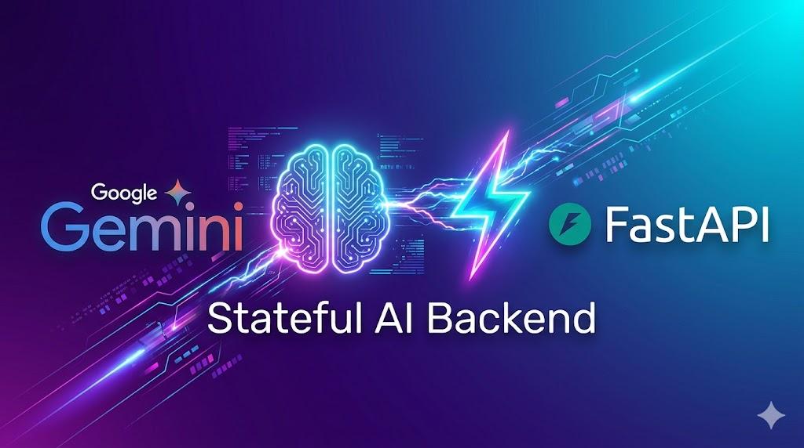

# 🌌 Aeon-AI
A high-performance, full-stack AI assistant powered by **Gemini 1.5 Flash** and **LangChain**. Featuring a custom-built interactive UI and a **FastAPI** backend with persistent session-based memory.

<p align="center">
  
</p>

---

## 🚀 Overview
**Aeon-AI** isn't just a wrapper; it's a context-aware conversational engine. By utilizing LangChain's `RunnableWithMessageHistory`, the assistant maintains unique chat histories for different users, making it ideal for personalized multi-user applications.

### ✨ Key Features
* **Contextual Memory:** Uses session-based storage to remember user names and previous interactions.
* **Custom UI:** A bespoke Frontend (HTML/CSS/JS) for a superior user experience compared to generic frameworks.
* **LCEL Orchestration:** Built using LangChain Expression Language for optimized prompt-model chaining.
* **FastAPI Backend:** Asynchronous, high-performance API endpoints with Pydantic data validation.

---

## 🛠 Tech Stack
* **LLM:** [Google Gemini 1.5 Flash](https://ai.google.dev/gemini-api/docs)
* **Orchestration:** [LangChain](https://www.langchain.com/) (LCEL & RunnableWithMessageHistory)
* **Backend:** [FastAPI](https://fastapi.tiangolo.com/) (Python 3.10+)
* **Frontend:** HTML5, CSS3, JavaScript (Fetch API)

---

## ⚙️ Installation & Setup

### 1. Clone the Repository
```bash
git clone [https://github.com/mohdanaslko/Aeon-AI.git](https://github.com/mohdanaslko/Aeon-AI.git)
cd Aeon-AI